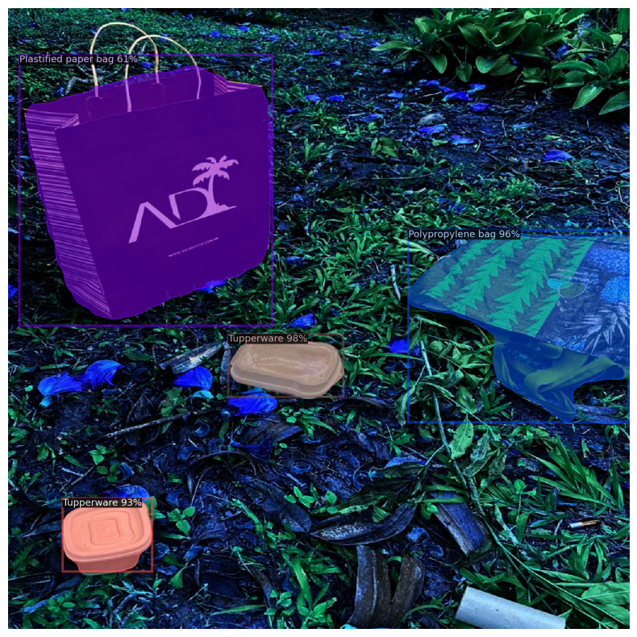

# Waste Classification and Segmentation with Detectron2 🗑️

This project leverages the power of Detectron2, a state-of-the-art object detection and instance segmentation framework by Facebook AI Research (FAIR), to accurately classify and segment waste items into predefined categories based on the color of dustbins they belong to. This model has been meticulously trained to recognize various types of waste, such as paper, cardboard, plastics, and biodegradables, and to assign them to the correct recycling bins, promoting efficient waste management and recycling processes.

## Overview

With the growing concern for environmental sustainability, proper waste sorting and recycling become imperative. This project introduces a deep learning-based approach to automate the classification and segmentation of waste items, facilitating their correct disposal and recycling. This model is trained on a custom dataset comprising 480 high-quality images of various waste items, utilizing Detectron2 for accurate instance segmentation.

## Features

- **Waste Item Detection:** Detect various waste items in an image with high precision.
- **Instance Segmentation:** Segment individual items, providing detailed boundaries.
- **Classification:** Classify waste items into categories corresponding to the color-coded dustbins:
  - 📘 **Blue Bin (Blaue Tonne):** For paper and cardboard.
  - 🟨 **Yellow Bin (Wertstofftonne):** For plastics and metals.
  - 🟫 **Brown Bin (Biomüll):** For biodegradable waste.
  - ⚫ **Grey Bin (Restmüll):** For non-recyclable waste.

## Model Training

The model was trained using Detectron2 on a dataset of 480 images, labeled for various types of waste. Training was performed for 4000 iterations with checkpoints saved every 500 iterations to monitor and mitigate overfitting. A careful balance of training, validation (where applicable), and test datasets ensured robust model performance.

## Visualization

Here are some end result of the model's instance segmentation and classification outputs:

## Usage

Detailed instructions on setting up the environment, training the model, and running inference can be found in the [usage documentation](docs/help.rst).

## Contribution

We welcome contributions from the community, whether it's in the form of bug reports, improvements, documentation, or new features.

## License

This project is licensed under the [MIT License](LICENSE).
